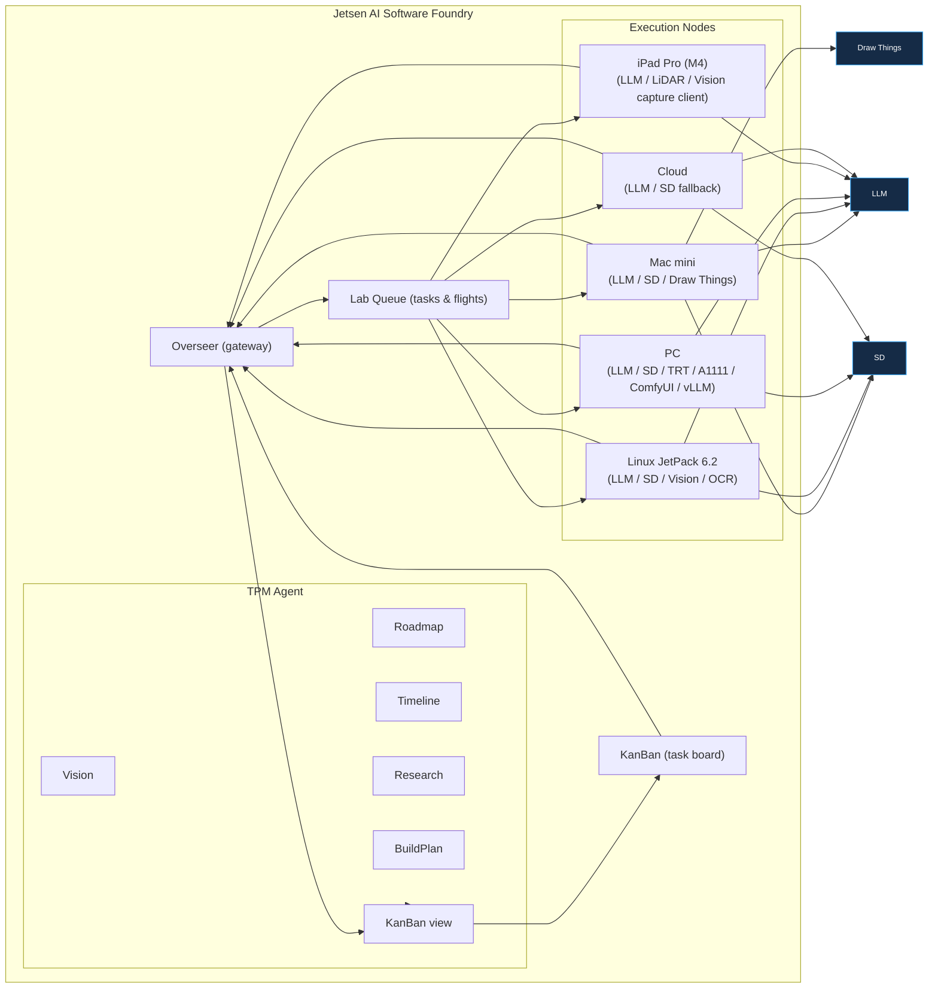

# JetsenAiSoftwareFoundry
The Foundry is a semi-automated software creation / lab orchestration tool that aims to connect nodes / robots into a collective in order to pool intelligence and capabilities across systems in real time.

## System Topology

